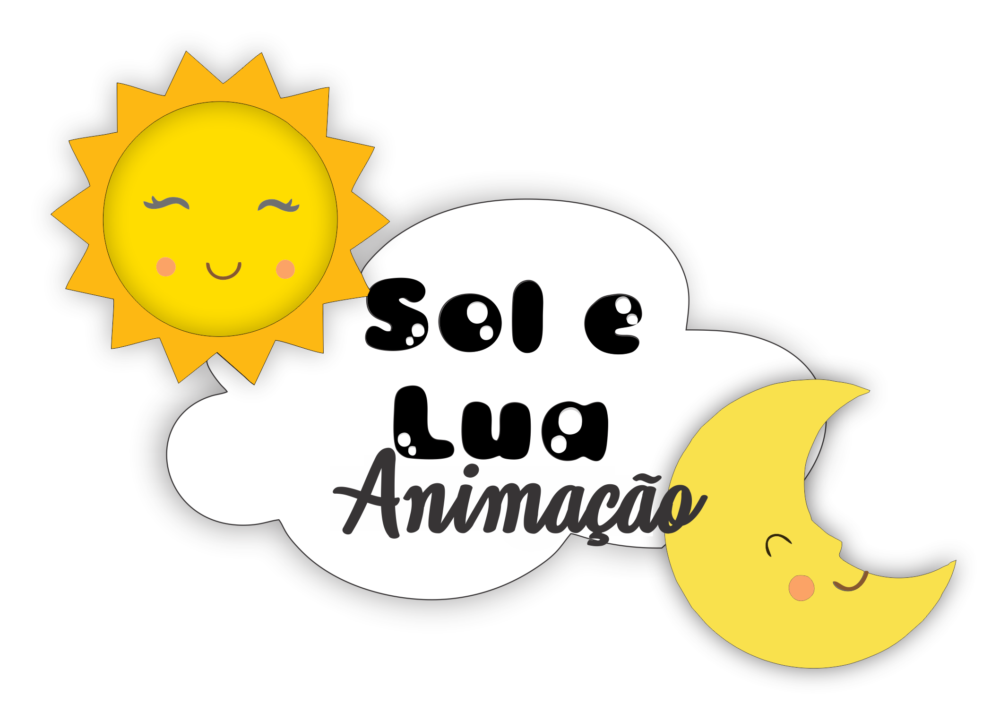

  

# Recreação

Esse documento/site tem como propósito esclarecer algumas coisas sobre a parte da recreação, que faz total diferença nos eventos.

Foi feito também para quem quiser ver alguma informação de forma rápida. Pois você pode salvar esse site e ter o acesso rápido

Sabemos que o animador que comanda o evento, porém se o animador fizer tudo sozinho fica ruim, por isso temos os recreadores, para dar uma facilitada e deixar o evento fluido.
 
Sem o recreador, o animador consegue sim fazer um evento e até fazer um bom evento, mas será muito mais difícil, por isso estamos ali para ajudar eles e auxiliar eles, e quem sabe no futuro não serão vocês como animadores sendo auxiliados por outros recreadores.

---

## Sumário

Vou dividir em Pré-evento, Evento, Pós-evento e Músicas. 

- [Pré-Evento](docs/pre.md)
- [Evento](docs/meio.md)
- [Pós-Evento](docs/pos.md)
- [Playlist](docs/play.md)
- [Caixa de som](docs/caixa/x.md) 

---

## Autor 

|   |
| :----------:                                                                                                                                                           | 
| [Arthur Sousa](https://github.com/Tutzs)                                                                                                                               |