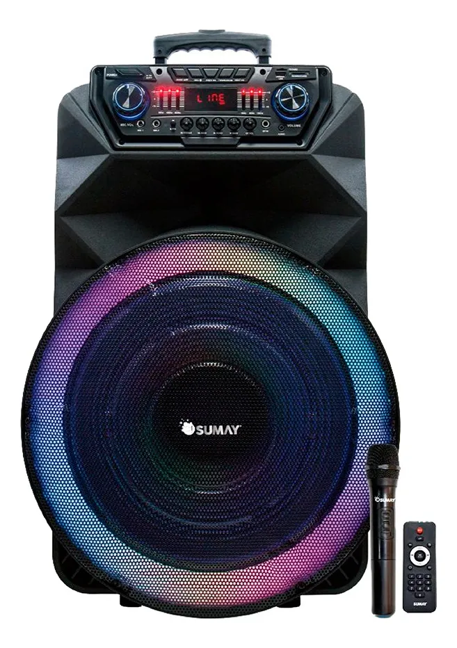
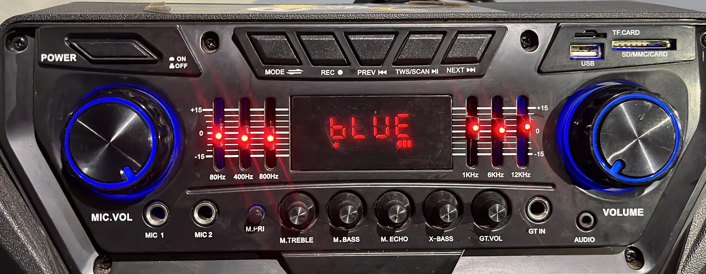

# Thunder Bolt (Nova)

A Thunder Bolt é nossa caixa de som mais atualizada, com qualidade de áudio superior.

## Painel principal

 

O painel de controle da Thunder Bolt conta com botões intuitivos para a operação:

1. **Liga/Desliga (*Power*)**: Para ligar e desligar o aparelho.
2. **Modo (*Mode*)**: Altera entre as fontes de áudio (*Line, Bluetooth, Rádio*).
3. **Gravação (REC)**: Inicia a gravação de áudio.
4. **Voltar a música (*Preview*)**: Retorna à faixa anterior.
5. **Pausar/Modo TWS**: Pausa a música ou ativa o modo de pareamento *TWS (True Wireless Stereo).*
6. **Próxima música (*Next*)**: Avança para a próxima faixa.

- Na lateral direita, a caixa possui entradas para **USB** e **Cartão de memória**.
- Dois *knobs* de volume permitem um ajuste individual: um para o microfone **(MIC. VOL)** e outro para a música (**Volume**). 
- No centro, o painel de *LED* exibe o modo de operação e o nível de bateria.

## Equalizador

Diferente da outra caixa nessa temos um equalizador de 6 faixas, começando em 80Hz e indo até 12KHz, recomendado deixar tudo no meio, caso você não tenha conhecimento.

- 80Hz: Controla os graves profundos
- 400Hz: Região dos graves-médios
- 800Hz: Médios
- 1KKz: Médios-altos
- 6KHz: Agudos
- 12KHz: Agudos-extremos

## Parte inferior

* **MIC 1 e MIC 2**: Entradas para microfones com fio.
* **M. PRI (*Microphone Priority*):** Prioriza o microfone, diminuindo automaticamente o volume da música ao detectar a fala.
* **M. TREBLE:** Controla os agudos do microfone.
* **M. BASS:** Controla os graves do microfone.
* **X. BASS:** Um recurso exclusivo deste modelo que controla o grave da música. Se você deixar o volume da música no zero e aumentar o X. BASS, apenas os graves tocarão, o que é útil para criar um efeito de fundo.
* **GT. VOL:** Controla o volume de uma guitarra conectada.
* **GT IN:** Entrada para guitarra.
* **AUDIO:** Entrada P2, para cabos auxiliares.

### Ajustes de Tom do Microfone

:::tip dica
Utilize os controles de *M. TREBLE e M. BASS* para garantir a clareza da sua voz:

- **M. TREBLE (Agudo do Microfone):**
  - Voz fina/estridente: Aumente o M. BASS para encorpar a voz e/ou diminua o M. TREBLE para suavizar os agudos.

- **M. BASS (Grave do Microfone):**
  - Voz abafada/pesada: Aumente o M. TREBLE para dar mais clareza e/ou diminua o M. BASS se os graves estiverem excessivos.
:::