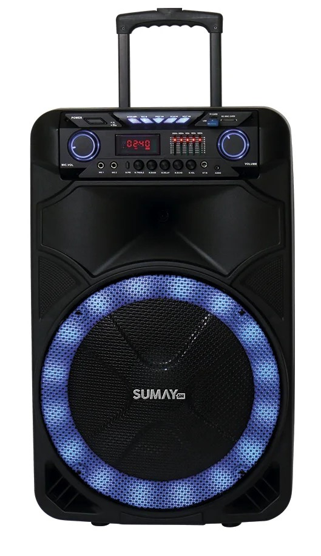
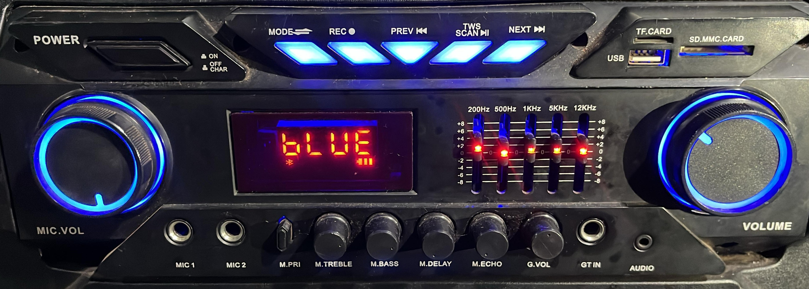

# Thunder X (Antiga)

Conhecer o equipamento é fundamental para garantir a melhor experiência sonora. Abaixo, detalhamos as funcionalidades da caixa de som Thunder X.

## Painel principal

O painel de controle da Thunder X conta com botões intuitivos para a operação:

1. **Liga/Desliga (*Power*)**: Para ligar e desligar o aparelho.
2. **Modo (*Mode*)**: Altera entre as fontes de áudio (Line, Bluetooth, Rádio).
3. **Gravação (REC)**: Inicia a gravação de áudio.
4. **Voltar a música (*Preview*)**: Retorna à faixa anterior.
5. **Pausar/Modo TWS**: Pausa a música ou ativa o modo de pareamento *TWS (True Wireless Stereo).*
6. **Próxima música (*Next*)**: Avança para a próxima faixa.

Na lateral direita, encontram-se as entradas para USB e cartão de memória.

### Controles de Volume

A caixa possui dois controles de volume independentes para otimizar o som:

- **MIC. VOL** - controla volume do microfone
- **Volume** - controla volume da música 

No centro do painel, o display de *LED* indica o modo de operação e o nível de bateria.

## Equalizador

Temos um equalizador de 5 faixas, começando em 200Hz e indo até 12KHz, recomendado deixar tudo no meio caso não saiba como mexer.

- **200Hz**: Ajusta as frequências mais graves.
- **500Hz**: Regula a região dos médios-graves.
- **1KKz**: Controla os médios.
- **5KHz**: Ajusta os médios-agudos.
- **12KHz**: Controla as frequências mais agudas.

## Parte inferior do painel

- **MIC 1 e MIC 2** - Entrada para microfone com fio
- **M. PRI(Microphone Priority)** - Prioridade do microfone, caso esteja ativado, o microfone se torna prioridade e abaixa a música.
- **M. TREBLE** - Controla os agudos do microfone.
- **M. BASS** - Controla os graves do microfone.
- **M. DELAY** - Adiciona efeito de delay à voz.
- **M. ECHO** - Adiciona efeito de eco à voz.
- **G. VOL** - Controla o volume da entrada de guitarra.
- **GT IN** - Entrada para Guitarra
- **AUDIO** - Entrada P2, para cabos auxiliares

### Ajustes de Tom do Microfone

:::tip dica
Para garantir que a voz saia com a melhor qualidade, utilize os controles de *M. TREBLE e M. BASS*:

- **Ajustando o Agudo (M. TREBLE):**

  - Se a voz soar muito fina ou estridente, aumente o **BASS** para dar mais corpo ou diminua o **TREBLE** para suavizar os agudos.

- **Ajustando o Grave (M. BASS):**

  - Se a voz soar abafada ou pesada, aumente o **TREBLE** para clareza ou diminua o **BASS** se os graves estiverem exagerados.
:::